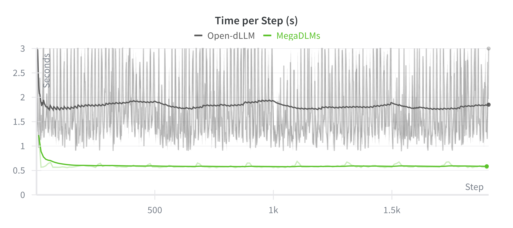
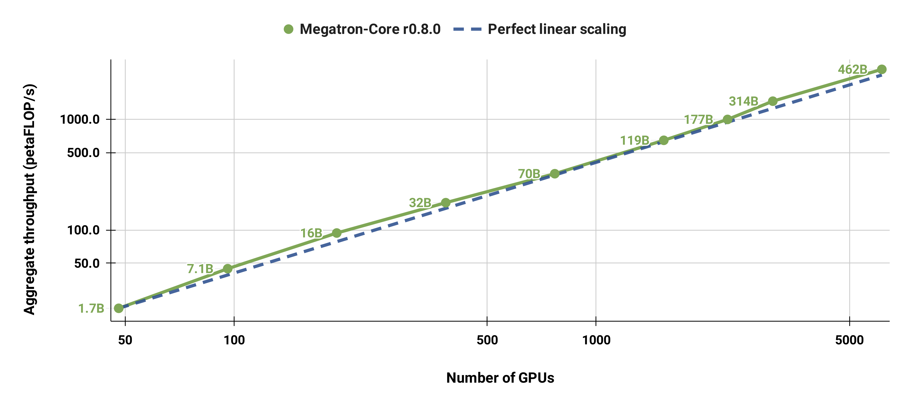
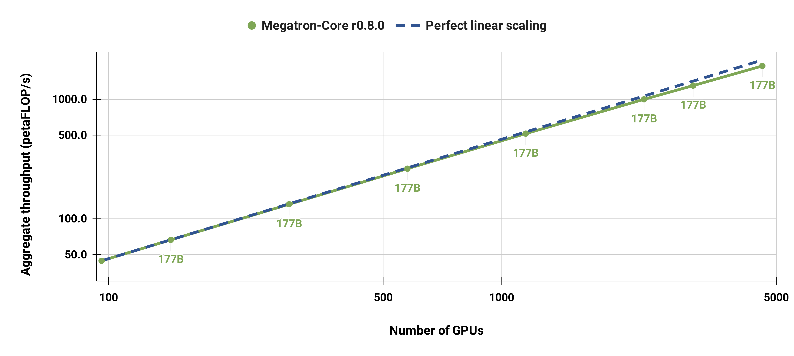

<div align="center">

MegaDLMs (Preview)
===========================

<h4>GPU-optimized codebase for training diffusion language models at any scale.</h4>

[](https://docs.nvidia.com/Megatron-Core/developer-guide/latest/index.html)
[](./CHANGELOG.md)
[](./LICENSE)

<div align="left">

<p align="center" width="100%">

</p>

<p align="center" width="100%">

</p>

<!-- <p align="center" width="100%">

</p> -->

# Latest News

- [2025-11-2] We release MegaDLMs, the training backend for [Quokka](https://github.com/JinjieNi/Quokka), [Super Data Learners](https://github.com/JinjieNi/dlms-are-super-data-learners), and [OpenMoE 2](https://github.com/JinjieNi/OpenMoE2), an ultra fast and scalable framework for any-scale DLM training. We will merge the MoE part once OpenMoE 2 training is done.

<br>


# Quick Start

<h3>Installation</h3>

---

We strongly recommend using the [PyTorch NGC Container](https://catalog.ngc.nvidia.com/orgs/nvidia/containers/pytorch) for optimal compatibility. 

The `24.11-py3` version (`nvcr.io/nvidia/pytorch:24.11-py3`) is recommended:

```
docker pull nvcr.io/nvidia/pytorch:24.11-py3
```

Or building an image with the docker file starting with:

```
FROM nvcr.io/nvidia/pytorch:24.11-py3

# the remaining Dockerfile content
```

> If external images are not supported in your cluster, follow the [Complete Installation Guide](https://github.com/NVIDIA/Megatron-LM?tab=readme-ov-file#installation) to install - Docker, pip variants (dev,lts,etc.), source installation, and system requirements

<h3>Setup Envs</h3>

---

Setup the environment variables as instructed in `envs/.env`.

<h3>Training a Diffusion Language Model from Scratch</h3>

---

We provide examples of the whole pipeline for training DLMs from scratch. You can find them under `examples/dlm_training`.

**Data Preparation**

See [here](#data-preparation) for details.

**Pre-train**
```
source envs/.env; bash examples/dlm_training/dlm_pretrain_1.7b.sh
```

> Find all training arguments in `custom_args/difflm.py` and `megatron/training/arguments.py`.

**Checkpoint Conversion**
```
source envs/.env; bash examples/dlm_training/ckpt_conversion.sh
source envs/.env; bash examples/dlm_training/ckpt_conversion_validation.sh
```

**Generate with Your Trained DLM**
```
source envs/.env; python examples/dlm_generation/dlm_inference.py
```

<br>


# Project Structure

MegaDLMs is built upon [Megatron-LM](https://github.com/NVIDIA/Megatron-LM/tree/main).

```
mega-dlms/
├── megatron/                    
│   ├── core/                    # Megatron Core (kernels, parallelism, building blocks)
│   │   ├── models/              # Transformer models
│   │   ├── transformer/         # Transformer building blocks
│   │   ├── tensor_parallel/     # Tensor parallelism
│   │   ├── pipeline_parallel/   # Pipeline parallelism
│   │   ├── distributed/         # Distributed training (FSDP, DDP)
│   │   ├── optimizer/           # Optimizers
│   │   ├── datasets/            # Dataset loaders
│   │   ├── inference/           # Inference engines
│   │   └── export/              # Model export (e.g. TensorRT-LLM)
│   ├── training/                # Training scripts
│   ├── inference/               # Inference server
│   ├── legacy/                  # Legacy components
│   └── post_training/           # Post-training (RLHF, etc.)
├── examples/                    # Ready-to-use training examples
├── tools/                       # Utility tools
├── tests/                       # Comprehensive test suite
└── docs/                        # Documentation
```

<br>

# System Requirements

### Hardware Requirements

- **FP8 Support**: NVIDIA Hopper, Ada, Blackwell GPUs
- **Recommended**: NVIDIA Turing architecture or later

### Software Requirements

- **CUDA/cuDNN/NCCL**: Latest stable versions
- **PyTorch**: Latest stable version
- **Transformer Engine**: Latest stable version
- **Python**: 3.12 recommended

<br>

# Performance Benchmarking

For the latest performance benchmarking results, please refer to [NVIDIA NeMo Framework Performance Summary](https://docs.nvidia.com/nemo-framework/user-guide/latest/performance/performance_summary.html).

Our codebase efficiently trains models from 2B to 462B parameters across thousands of GPUs, achieving up to **47% Model FLOP Utilization (MFU)** on H100 clusters.


**Benchmark Configuration:**

- **Vocabulary size**: 131,072 tokens
- **Sequence length**: 4096 tokens  
- **Model scaling**: Varied hidden size, attention heads, and layers to achieve target parameter counts
- **Communication optimizations**: Fine-grained overlapping with DP (`--overlap-grad-reduce`, `--overlap-param-gather`), TP (`--tp-comm-overlap`), and PP (enabled by default)

**Key Results:**

- **6144 H100 GPUs**: Successfully benchmarked 462B parameter model training
- **Superlinear scaling**: MFU increases from 41% to 47-48% with model size
- **End-to-end measurement**: Throughputs include all operations (data loading, optimizer steps, communication, logging)
- **Production ready**: Full training pipeline with checkpointing and fault tolerance
- *Note: Performance results measured without training to convergence*

## Weak Scaling Results

Our weak scaled results show superlinear scaling (MFU increases from 41% for the smallest model considered to 47-48% for the largest models); this is because larger GEMMs have higher arithmetic intensity and are consequently more efficient to execute.


## Strong Scaling Results

We also strong scaled the standard GPT-3 model (our version has slightly more than 175 billion parameters due to larger vocabulary size) from 96 H100 GPUs to 4608 GPUs, using the same batch size of 1152 sequences throughout. Communication becomes more exposed at larger scale, leading to a reduction in MFU from 47% to 42%.


<br>


# Training

## Getting Started

### Simple Training Example

**Pre-train**
```
examples/dlm_training/dlm_pretrain_1.7b.sh
```

**Checkpoint Conversion**
```
examples/dlm_training/ckpt_conversion.sh
examples/dlm_training/ckpt_conversion_validation.sh
```

**Generate with Your Trained DLM**
```
mega-dlms/examples/dlm_generation/dlm_inference.py
```

## Data Preparation

### JSONL Data Format

```json
{"text": "Your training text here..."}
{"text": "Another training sample..."}
```

### Basic Preprocessing

```bash
python tools/preprocess_data.py \
    --input data.jsonl \
    --output-prefix processed_data \
    --tokenizer-type HuggingFaceTokenizer \
    --tokenizer-model /path/to/tokenizer.model \
    --workers 8 \
    --append-eod
```

### Key Arguments

- `--input`: Path to input JSON/JSONL file
- `--output-prefix`: Prefix for output binary files (.bin and .idx)
- `--tokenizer-type`: Tokenizer type (`HuggingFaceTokenizer`, `GPT2BPETokenizer`, etc.)
- `--tokenizer-model`: Path to tokenizer model file
- `--workers`: Number of parallel workers for processing
- `--append-eod`: Add end-of-document token

<br>

# Parallelism Strategies

## Data Parallelism (DP)

### Standard Data Parallel

```bash
# Standard DDP - replicate model on each GPU
torchrun --nproc_per_node=8 pretrain_gpt.py \
    --data-parallel-sharding-strategy no_shard
```

### Fully Sharded Data Parallel (FSDP)

```bash
# Megatron's optimized FSDP (~15% faster than PyTorch FSDP2)
--use-custom-fsdp

# PyTorch FSDP2
--use-torch-fsdp2

# Sharding strategies
--data-parallel-sharding-strategy optim              # Shard optimizer states (ZeRO-1)
--data-parallel-sharding-strategy optim_grads        # Shard gradients + optimizer (ZeRO-2)
--data-parallel-sharding-strategy optim_grads_params # Shard parameters + gradients + optimizer (ZeRO-3)
```

## Tensor Parallelism (TP)

Split individual model layers across GPUs:

```bash
--tensor-model-parallel-size 4  # 4-way tensor parallelism
--sequence-parallel             # Enable sequence parallelism (recommended with TP)
```

## Pipeline Parallelism (PP)

Split model depth across GPUs:

```bash
--pipeline-model-parallel-size 8     # 8 pipeline stages
--virtual-pipeline-model-parallel-size 4  # Virtual pipeline for better load balancing
```

## Context Parallelism (CP)

Split long sequences across GPUs for handling long contexts:

```bash
--context-parallel-size 2                    # 2-way context parallelism
--cp-comm-type p2p                          # Communication: p2p, a2a, allgather, a2a+p2p
--hierarchical-context-parallel-sizes 2 4   # Hierarchical context parallelism
```

## Expert Parallelism (EP)

For Mixture of Experts (MoE) models:

```bash
--expert-model-parallel-size 4  # 4-way expert parallelism
--num-experts 8                 # 8 experts per MoE layer
--moe-grouped-gemm              # Optimize expert computation
```

## Combining Parallelism Strategies

### Parallelism Selection Guide

Based on [NVIDIA NeMo production configurations](https://github.com/NVIDIA/NeMo/tree/main/scripts/performance/recommended_model_configs):

| Model | Size | GPUs | TP | PP | CP | EP | Notes |
|-------|------|------|----|----|----|----|-------|
| **LLama-3** | 8B | 8 | 1 | 1 | 2 | 1 | CP for long seqlen (8K) |
| **LLama-3** | 70B | 64 | 4 | 4 | 2 | 1 | TP+PP |
| **LLama-3.1** | 405B | 1024 | 8 | 8 | 2 | 1 | 3D parallelism for scale |
| **GPT-3** | 175B | 128-512 | 4 | 8 | 1 | 1 | Large model config |
| **Mixtral** | 8x7B | 64 | 1 | 4 | 1 | 8 | EP for MoE |
| **Mixtral** | 8x22B | 256 | 4 | 4 | 8 | 8 | Combined TP+EP for large MoE |
| **DeepSeek-V3** | 671B | 1024 | 2 | 16 | 1 | 64 | Large MoE config |

### MoE-Specific Requirements

**Important**: When combining Expert Parallelism (EP) with Tensor Parallelism (TP), **Sequence Parallelism (SP) must be enabled**.

## Performance Optimizations

| Feature | Flag | Benefit |
|---------|------|---------|
| **FlashAttention** | `--attention-backend` | Faster attention and lower memory usage |
| **FP8 Training** | `--fp8-hybrid` | Faster training |
| **Activation Checkpointing** | `--recompute-activations` | Reduced memory usage |
| **Data Parallelism Communication Overlap** | `--overlap-grad-reduce` | Faster distributed training |
| **Distributed Optimizer** | `--use-distributed-optimizer` | Reduced checkpointing time |

**→ [NVIDIA NeMo Framework Performance Tuning Guide](https://docs.nvidia.com/nemo-framework/user-guide/latest/performance/performance-guide.html#performance-tuning-guide)** - Comprehensive performance optimization guide covering advanced tuning techniques, communication overlaps, memory optimizations, and profiling options.

### FlashAttention

[FlashAttention](https://github.com/Dao-AILab/flash-attention) is a fast and memory-efficient attention algorithm. We recommend the default usage, which uses cuDNN for attention via Transformer Engine and provides up to 50% speedups on forward and 84% on backward propagation with FP8 kernels. The `flash-attn` package is also supported via `--use-flash-attn`.

### Mixed Precision Training

```bash
--fp16                    # Standard FP16
--bf16                    # BFloat16 (recommended for large models)
--fp8-hybrid              # FP8 training (Hopper, Ada, and Blackwell GPUs)
```

### Activation Checkpointing and Recomputation

```bash
# For limited memory
--recompute-activations

# For extreme memory constraints
--recompute-granularity full \
--recompute-method uniform
```

### Data Parallelism Communication Overlap

```bash
--overlap-grad-reduce
--overlap-param-gather
```

### Distributed Optimizer

```bash
--use-distributed-optimizer
```

<br>


<br>

# Todo List

**This is an actively maintained codebase! We will gradually support all of the below features.** 

🤲🏻 Contribute to this repo to enpower the development of diffusion language models!

- [x]  Native Dense Pre-training
- [ ]  Native MoE Pre-training (release after the OpenMoE 2 training is done)
- [ ]  SFT
- [ ]  RL
- [ ]  More features!


# Citation

```bibtex
@misc{ni2025megadlms,
  title={MegaDLMs: Training Diffusion Language Models at Any Scale},
  author={Ni, Jinjie},
  year={2025}
  howpublished={\url{https://github.com/JinjieNi/MegaDLMs}},
}
```